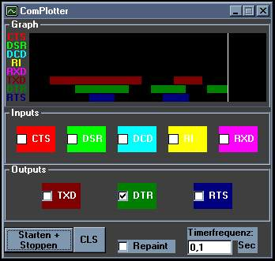



## COMplotter

### Description

Plotting Comsignals in a grafical and usefull way
 
### More Info
 
You can setup the comport in the source. Its not yet implemented in the Gfx-interface. sorry for that.

don't know if it works on win 2k / xp with this version of DLL

             |
---                |---
**Submitted On**   |2003-08-10 03:27:34
**By**             |[buhhmann](https://github.com/Planet-Source-Code/PSCIndex/blob/master/ByAuthor/buhhmann.md)
**Level**          |Intermediate
**User Rating**    |4.0 (8 globes from 2 users)
**Compatibility**  |VB 5\.0, VB 6\.0
**Category**       |[Complete Applications](https://github.com/Planet-Source-Code/PSCIndex/blob/master/ByCategory/complete-applications__1-27.md)
**World**          |[Visual Basic](https://github.com/Planet-Source-Code/PSCIndex/blob/master/ByWorld/visual-basic.md)
**Archive File**   |[COMplotter1627268102003\.zip](https://github.com/Planet-Source-Code/buhhmann-complotter__1-47574/archive/master.zip)

